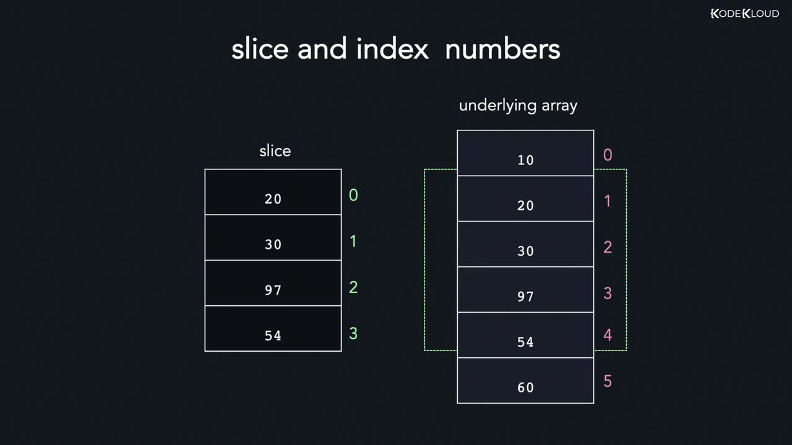
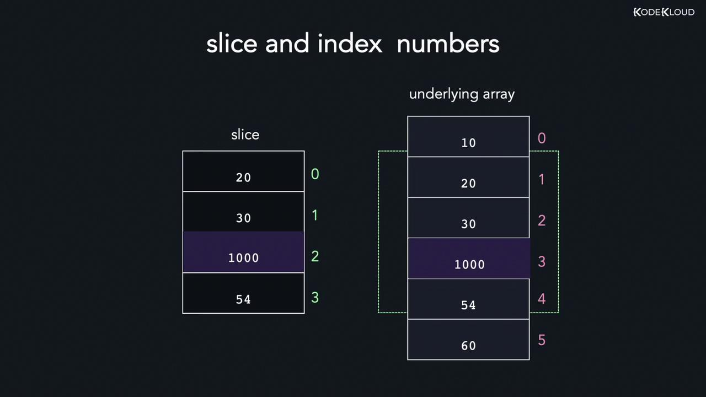

# Arrays, Slices and Maps

## Arrays

An array is a collection of elements stored in contiguous memory locations. For instance, you could use an array to hold a series of integers representing students’ roll numbers or strings representing character names in a show.

Because array elements are stored contiguously, if an integer occupies 4 bytes and the first element is at memory address 200, the next will be at address 204. Arrays are known as homogeneous collections since they store elements of a single data type.

> [!Important]
> Remember, arrays in Go have a fixed length. After declaring an array with a specific size, you cannot change its length, and every element must be of the same type. In Go, an array stores a pointer to its first element along with its length (the number of elements) and capacity (which, for arrays, is the same as the length).

Because of the contiguous nature of memory allocation, you can even compute the address of any element using its index.

### Array Indices

Array indexing in Golang starts at 0. To access an element, use its index within square brackets.

### Modify Array Elements

You can update array elements by referring to their indices.

```go
package main
import "fmt"

func main() {
    var grades [5]int = [5]int{90, 80, 70, 80, 97}
    fmt.Println(grades)
    grades[1] = 100
    fmt.Println(grades)
}
```

### Looping Through Arrays

- **Using Traditional `for` loop**

```go
package main
import "fmt"

func main() {
    var grades [5]int = [5]int{90, 80, 70, 80, 97}
    for i := 0; i < len(grades); i++ {
        fmt.Println(grades[i])
    }
}
```

- **Using `range` keyword**: The `range` keyword simplifies iteration by returning both the index and the element.

```go
package main
import "fmt"

func main() {
    var grades [5]int = [5]int{90, 80, 70, 80, 97}
    for index, element := range grades {
        fmt.Println(index, "=>", element)
    }
}
```

### Multi-Dimensional Arrays

A multi-dimensional array is essentially an array of arrays. The simplest form is a two-dimensional (2D) array. For example, a 3x2 array has three sub-arrays with two elements each.

To access elements in a 2D array, use two indices. `arr[2][0]`

## Slices

Slices in Go represent continuous segments of an underlying array and provide access to a numbered sequence of elements. Unlike arrays, slices are dynamically sized, allowing you to easily add or remove elements as needed.

A slice consists of three key components:

- **Pointer**: Refers to the first accessible element in the underlying array (which may not be the first element of the entire array)
- **Length**: The number of elements contained in the slice.
- **Capacity**: The total number of elements in the underlying array starting from the first element in the slice.

For example, a slice with a length of 4 and a capacity of 5 will allow the functions len and cap to retrieve these values respectively.

### Understanding Slices with Arrays

A slice is essentially a reference to an underlying array. You can construct a slice from an array by specifying a start index and an end index. The slice starts at the given start index and includes elements up to, but not including, the end index

```go
arr[start_index : end_index]

array[0:3]
```

If you omit the lower bound, it defaults to 0. Similarly, omitting the upper bound causes the slice to include the entire array.

### Create Slices with the `make` function

Another method to create a slice is by using the built-in `make` function. This function requires the data type, initial length, and capacity.

```go
// Syntax:
slice := make([]<data_type>, length, capacity)
// Example:
slice := make([]int, 5, 10)
fmt.Println(slice)
fmt.Println(len(slice))
fmt.Println(cap(slice))
```

The `make` function allocates an underlying array of the specified capacity and returns a slice that refers to it. This approach is especially useful when you want to create an empty slice with a predetermined capacity.

> [!Important]
> The default zero value for integers is 0. When working with arrays, remember that the array's capacity is equal to its length. However, for slices, the capacity begins from the first element accessed in the underlying array.

### Slices as References

Because a slice is a reference to an underlying array, modifying an element in the slice will also modify the corresponding element in the array. However, keep in mind that the slice maintains its own indexing starting at 0; therefore, the index in the slice does not always match the index in the underlying array.





### Appending Elements to a Slice

Appending new elements to a slice is done using the built-in `append` function. This function takes the original slice followed by new values, and returns a new slice containing both the existing and added elements. If the underlying array lacks sufficient capacity, a new, larger array is allocated—often doubling the previous capacity.

```go
// General syntax:
func append(s []T, vs ...T) []T

// Example usage:
slice = append(slice, 10, 20, 30)
```

### Deleting Elements from a Slice

Deleting an element from a slice involves creating a new slice that omits the undesired element.

1. Slicing elements before the target index
2. Slicing elements after the target index
3. Appending the two slices together

### Copying Elements Between Slices

Go provides a built-in `copy` function to copy elements from one slice to another. This function returns the number of elements that were successfully copied, which is the minimum of the lengths of the source and destination slices. The syntax is:

```go
// Syntax:
func copy(dst, src []Type) int

// Example:
num := copy(dest_slice, src_slice)
```

### Looping Through Slices

Looping through a slice is similar to iterating over an array. The `range` keyword offers a concise way to access both the index and value of each element in the slice
